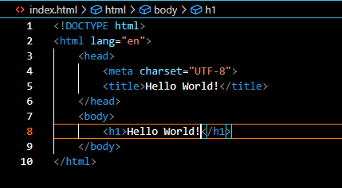

# Hello World!
## Description
<h3>Anwendung:</h3> "Hello World" ist ein kleines Computerprogramm, das auf möglichst einfache Weise zeigen soll, welche Anweisungen oder Bestandteile für ein vollständiges Programm in einer Programmiersprache benötigt werden, und somit einen ersten Einblick in die Syntax gibt.

<h3>Voraussetzung:</h3> Installieren einer lokalen Programmierumgebung auf dem Computer.

<h3>Installationsvorgang:</h3> Das "Hello World" ausgegeben wird, haben wir dem Befehl "h1" zu verdanken.